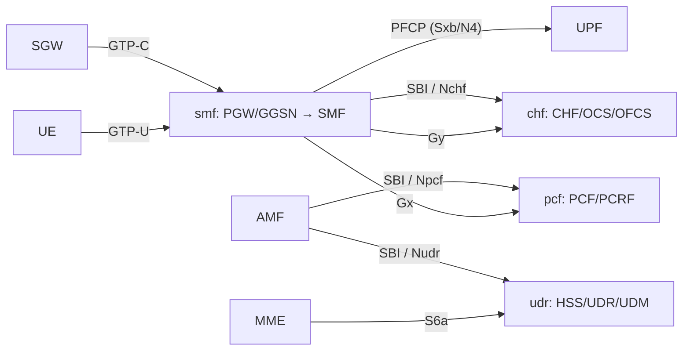

# Interfaces map: which NF speaks what

> Status: scaffold. The interface lists are seeded from each repo's README/CLAUDE.md; verify against the code before treating any single entry as complete.

## 1. Per-component interfaces

| Component | Role | 4G / EPC (Diameter, GTP, …) | 5G SBI | Subscriber/auth |
| --- | --- | --- | --- | --- |
| `smf` | GGSN / PDN-GW → SMF | GTP-C, GTP-U, PFCP (Sxb / N4), Gx/Ro/Rf + NASREQ in `smf_aaa`, RADIUS on Gi/SGi | Serves **Nbsf** management (`/sbi/nbsf-management/v1/pcfBindings`); consumes other NFs' SBIs via `smf_sbi_client` (gun, HTTP/2). Nsmf: TODO | — |
| `udr` | HSS + UDR/UDM | S6a (to MME), App-Id 16777251 | **Nudr-DR** (`/nudr-dr/v1/...`: am-data, authentication-subscription, amf-3gpp-access). Nudm: TODO | MILENAGE / EPS-AKA (`udr_crypto`) |
| `pcf` | PCF + PCRF | Gx (App-Id 16777238) | **Npcf_SMPolicyControl** (`/npcf-smpolicycontrol/v1/sm-policies`). Others: TODO | — |
| `chf` | CHF + OCS + OFCS | Gy/Ro (App-Id 4), Rf (Acct-App-Id 3) | **Nchf** Converged (`/nchf-convergedcharging/v3`) + Offline-Only (`/nchf-offlineonlycharging/v1`), TS 32.291 | — |

> [!NOTE]
> Reference-point details (exact Application-Ids, resource paths, supported commands) belong in each component's **Interface Reference** docs — author those with the `documenting-network-functions` skill, not here. This table is a map, not a spec.

## 2. How the functions interconnect

*Informative.* The diagram shows the dominant relationships, not every reference point. Edge labels name the interface each link carries.

## 3. Interface vocabulary (use verbatim)

Use these exact names everywhere (code, docs, diagrams), expanded on first use:

- **GTP-C / GTP-U** — GPRS Tunnelling Protocol, control / user plane.
- **PFCP** — Packet Forwarding Control Protocol (Sxb on 4G, N4 on 5G), SMF↔UPF.
- **Gx** — policy (PCEF↔PCRF). **Gy / Ro** — online charging. **Rf** — offline charging.
- **S6a** — MME↔HSS (Diameter). **Cx** — to HSS for IMS (TODO: confirm if in scope).
- **SBI** — 5G Service-Based Interface (HTTP/2): **Nudr**, **Nudm**, **Npcf**, **Nsmf**, **Nchf**.

## 4. TODO for the maintainer

- [ ] `smf`: confirm whether **Nsmf** (server) is planned in addition to the Nbsf surface it serves today and the outbound `smf_sbi_client`.
- [ ] `udr`: confirm whether **Nudm** is exposed in addition to **Nudr-DR** (only the three Nudr-DR resources are implemented today).
- [ ] `pcf`: confirm the Npcf service set beyond SMPolicyControl (AMPolicyControl, PolicyAuthorization, …).
- [ ] State which interfaces are implemented vs planned per component, so agents do not document non-existent behaviour. Today's implemented SBI surfaces are listed in the table above; treat anything not listed as not-yet-implemented until verified.
