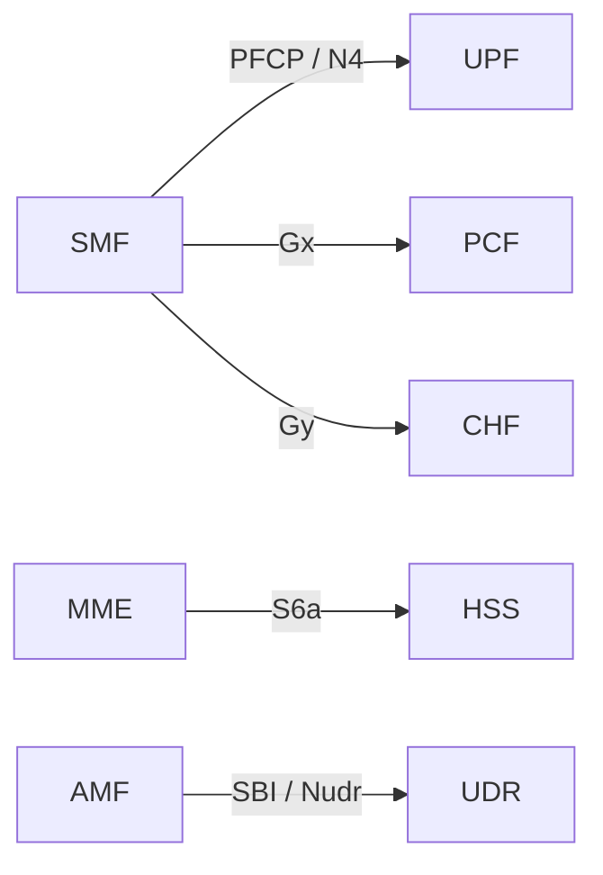
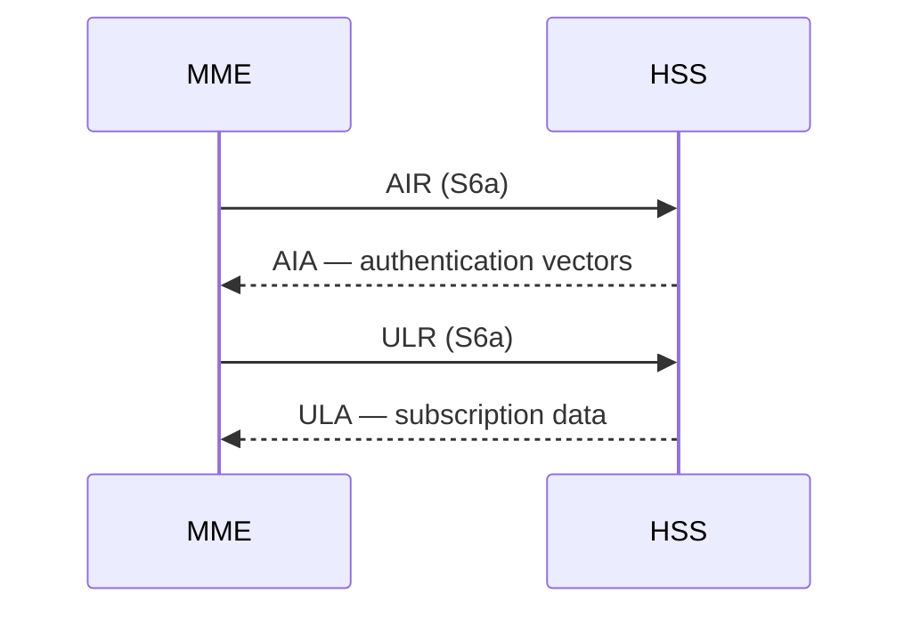
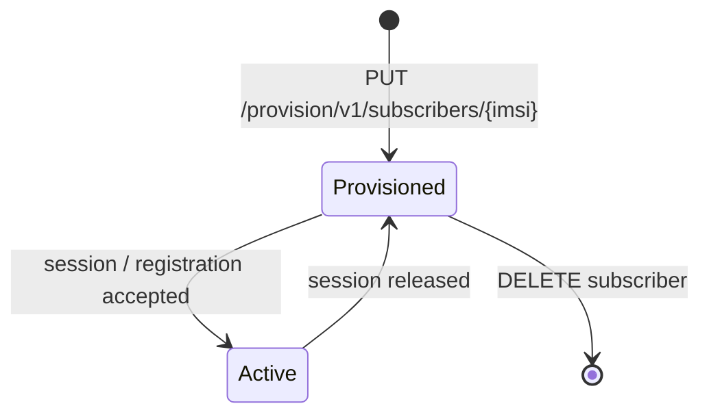

<!--
TEMPLATE / REFERENCE: Diagram conventions
This file is BOTH the conventions to follow AND a template to copy diagram blocks
from. Follow ../documentation-style.md §11. Author diagrams in Mermaid.
-->

# Diagram Conventions

**Applies to:** <component> <version> · **Revised:** <YYYY-MM-DD>

Diagrams in next-nf documentation follow these conventions so that they render
everywhere (GitHub, ExDoc), diff cleanly in review, and stay consistent across
documents and across network functions.

## 1. Tooling

- Author every diagram in **Mermaid**, in a fenced ```` ```mermaid ```` block. Do not
  embed binary images for diagrams that Mermaid can express.
- Keep one diagram per block. A diagram that needs a paragraph of caveats is doing
  too much — split it.

### Rendering constraints (GitHub Mermaid)

GitHub's Mermaid parser silently fails to render a diagram on a couple of
characters that are easy to introduce. In labels — participant aliases, node
labels, message text, and `Note` text:

- Do **not** put `->` or `-->` inside a label (e.g. a `participant X as A -> B`
  alias). The sequence parser reads the arrow as a message and the whole diagram
  fails to render. Use the Unicode arrow `→` instead, or a comma.
- Do **not** put a semicolon `;` inside a label. Mermaid treats `;` as a
  statement separator, which breaks parsing. Use a comma or split the label with
  `<br/>`.
- Use `<br/>` for line breaks in labels — never a literal `\n`.

## 2. Choosing the diagram type

| Show… | Use | Mermaid kind |
| --- | --- | --- |
| Deployment topology (nodes, network functions, links) | Deployment diagram | `flowchart` |
| A signalling flow over time (Attach, AIR/ULR, PFCP session establishment, Gx/Gy CCR/CCA) | Sequence diagram | `sequenceDiagram` |
| A lifecycle (subscriber state, session state, peer-connection state) | State diagram | `stateDiagram-v2` |

## 3. Labelling rules

- Name network functions with the defined abbreviations: `UE`, `gNB`, `MME`, `AMF`, `SMF`, `PGW`, `UPF`, `HSS`, `UDR`, `PCF`, `CHF`.
- Label every link or message with the interface it carries: `GTP-C`, `GTP-U`, `PFCP`, `Gx`, `Gy`, `Rf`, `S6a`, `Cx`, `SBI` (`Nudr`, `Npcf`, `Nchf`).
- Use the exact command/operation names on messages: `AIR`, `ULR`, `PUR`, `CLR` (S6a); `CCR`, `CCA` (Gx/Gy); PFCP `Session Establishment`/`Modification`/`Deletion`; HTTP method + resource (SBI).
- Mark each diagram **normative** or **informative** in its caption. A normative diagram carries requirements (e.g. a mandated message order); an informative one aids understanding only.

## 4. Examples

### Deployment (informative)



### Signalling sequence (normative)

*The order of messages below is normative.*



### Lifecycle (informative)


